# Hello World .Net com K8s


Para usar o projeto Hello World .Net com K8s, siga estes passos:

1. Certifique-se que você está dentro do diretório `hello-world-com-kubernetes-languages/dotnet`.

2. Construa a imagem Docker:
```bash
docker build -t hello-world-dotnet:latest .
```
Obs.: Certifique-se que seu Docker está rodando.

3. Taggear a imagem para garantir que ela corresponda ao nome que será usado no Kubernetes:
```bash
docker tag hello-world-dotnet:latest localhost/hello-world-dotnet:latest
```

4. Por último, verifique se a imagem foi criada corretamente:
```bash
docker images localhost/hello-world-dotnet
```
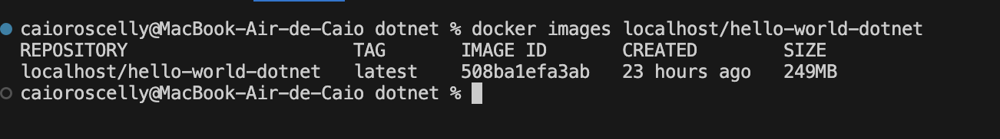

## Deploy com Kubernetes

Para fazer o deploy no cluster K8s, primeiro vamos criar e configurar o cluster:

1. Certifique-se de que o Kubernetes e Kind estão rodando.
```bash
kubectl version
kind version
```

1.1. Se nenhum dos comandos abaixo funcionar é porque ou não estão instalados ou não foram inicializados corretamente -> Neste caso volte à seção de configuração local e revise a instalação das 3 ferramentas.

2. Verifique os clusters disponíveis. Se houver um cluster default, você pode usá-lo. Se não, crie um novo cluster e use-o.
```bash
# Listar todos os clusters disponíveis
kubectl config get-contexts

# Se não existir nenhum cluster ativo, ou se você preferir criar um novo cluster com Kind
kind create cluster --name <nome-do--novo-cluster>

# Mudar para um contexto de cluster específico
kubectl config use-context <nome-do-cluster>
```

3. [Opcional] Você pode usar o namespace default existente ou criar um novo
```bash
# Listar os namespaces existentes
kubectl get namespaces

# Configurar um dos namespaces como padrão
kubectl config set-context --current --namespace=<namespace-name>

# Se desejar criar e usar um namespace novo chamado 'my-namespace' ao invés de usar um namespace default existente
kubectl create namespace my-namespace
kubectl config set-context --current --namespace=my-namespace
```

4. Para aplicar o [manifest.yaml](manifest.yaml) e fazer o deploy da aplicação no seu cluster Kubernetes, use o comando:
```bash
kubectl apply -f manifest.yaml
```
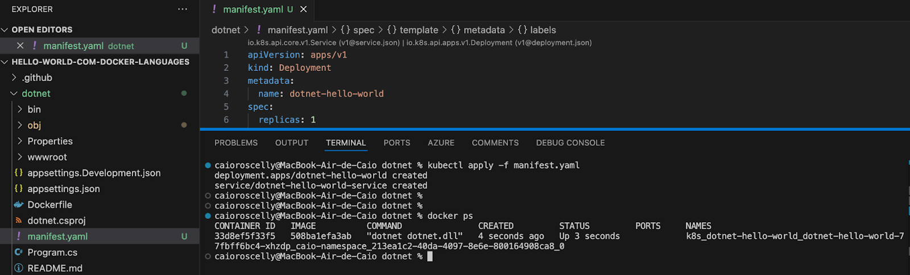

5. No fim disso, você terá uma aplicação rodando em cima de um container, como mostra a imagem a seguir. Além disso, você poderá acessar a aplicação através de http://localhost:30000 após o deploy.

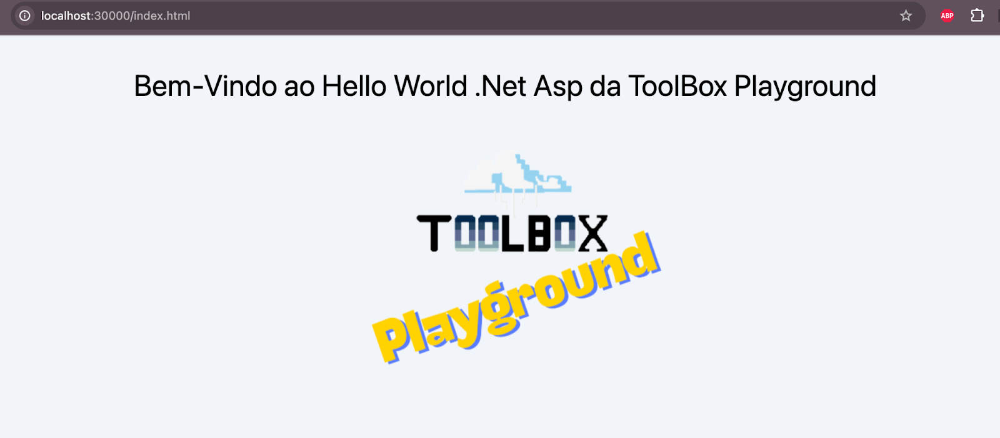

[Opcional]  A criação do Deployment e do Serviço também podem ser feito via linha de comando e sem a necessidade da criação do manifesto, mas encorajamos que criem o manifesto por ser uma boa prática.

```bash
# Exemplo Criação de Deployment e Service via kubectl command line e sem o manifesto

# Criar um deployment chamado 'my-deployment' com a imagem do Grafana
kubectl create deployment my-deployment --image=localhost/hello-world-dotnet:latest --namespace=my-namespace
# Verificar o Deployment
kubectl get deployments --namespace=my-namespace

# Expor o deployment 'my-deployment' via NodePort
kubectl expose deployment my-deployment --type=NodePort --port=8080 --target-port=30000 --protocol=TCP

# Obter o serviço exposto para encontrar o NodePort atribuído
kubectl get service my-deployment --namespace=my-namespace
```

## Explicando o manifesto k8s

O manifesto do Kubernetes define a configuração e o comportamento dos recursos no cluster. As partes essenciais do manifesto incluem o tipo de recurso (kind), especificações (spec), e configurações dos contêineres (containers) com detalhes sobre imagens, portas, e recursos de computação.

### Diferença entre kubectl apply e kubectl create:

**kubectl apply**: Recomendado para gerenciamento declarativo dos recursos, ou seja quando declaramos um arquivo yaml contendo os recursos do serviço e das pods. Permite atualizar e criar recursos com base no arquivo de manifesto. Mantém um registro dos arquivos aplicados para permitir atualizações contínuas.

**kubectl create**: Usado para criação imperativa. Cria recursos baseando-se em um arquivo ou stdin (linha de comando, como fizemos no exemplo anterior), mas não gerencia mudanças incrementais ou registros.

Usar kubectl apply oferece mais flexibilidade para atualizações contínuas e gerenciamento de estado desejado, enquanto kubectl create é útil para criações simples e diretas sem a necessidade de atualizações futuras.

A seguir, alguns objetos chave do arquivo manifesto:

1. **kind: Deployment**
O Deployment controla a criação, atualização e remoção de pods de acordo com as definições especificadas. Ele ajuda a manter as instâncias de aplicativos atualizadas.

2. **spec**:
Define o comportamento desejado do pod, detalhando como os contêineres devem operar.

3. **replicas**:
Especifica o número de réplicas/pods que o Kubernetes deve manter em execução. O padrão é 1 se não especificado.

4. **containers**:
Lista de contêineres dentro do pod. A configuração de cada contêiner, incluindo a imagem a ser usada, portas a serem expostas e os recursos necessários.

5. **resources**:
- Define os limites de recursos para os contêineres, como CPU e memória, garantindo que o contêiner não ultrapasse os recursos alocados.

- **requests**: Especifica a quantidade mínima de recursos que o contêiner deve ter garantido.

- **limits**: Define o máximo de recursos que o contêiner pode usar.

Através desse arquivo Deployment, o Kubernetes pode gerenciar automaticamente a aplicação, escalonando-a ou ajustando-a conforme necessário baseado nas definições de recursos e réplicas. Para mais informações, consulte a documentação oficial.

## Testando a App Rodando Após Deploy no Cluster K8S

Com todos os passos anteriores feitos, sua aplicação deve estar rodando localmente sobre um cluster kubernetes. Você pode executar os seguintes comandos para verificar seu deployment, serviço e pods rodando para o seu service. Esta seção vai mostrar como operar seu serviço através de **Comandos Kubernetes** para:

1. Verificar Deployment, Serviços e pods: 
```bash
kubectl get deployment
kubectl describe deployment dotnet-hello-world (opcional)
kubectl get service
kubectl get pods ou docker ps
kubectl describe pod <nome-do-pod>
```

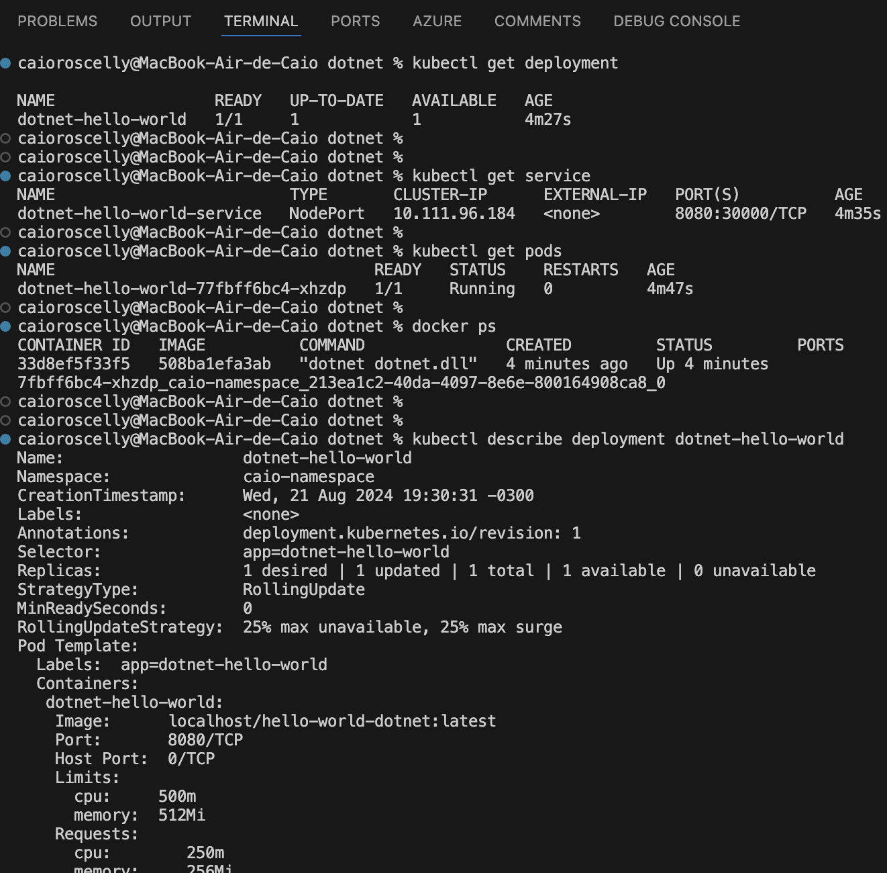

2. **Acesso à aplicação**: A aplicação pode ser acessada através do endereço http://localhost:30000 após o deploy, dependendo da configuração do NodePort no serviço, e verá que sua aplicação dotnet está Up & Running:


3. **Pods: Logs, Debug, Acesso e Troubleshooting**:
```bash
kubectl get pods
kubectl logs <my_pod_name>

# Executar um shell interativo em um contêiner específico
kubectl exec -it <nome-do-pod> -- /bin/bash

# Iniciar uma sessão de debug para um pod problemático
kubectl debug -it <nome-do-pod> --image=<imagem-de-debug> --copy-to=<nome-do-pod-debug>
```

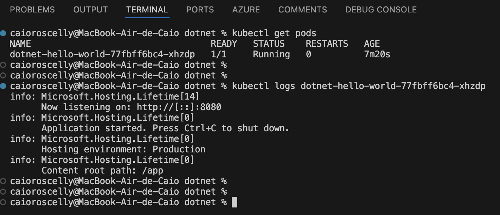

4. **Visualizar uso de recursos**: Deve ter o [MetricsServer](https://github.com/kubernetes-sigs/metrics-server.git) habilitado.
```bash
# Ver uso de CPU e memória dos pods
kubectl top pod

# Ver uso de CPU e memória dos nós
kubectl top nodes
```

5. **Listar eventos do cluster**:
```bash
# Listar eventos recentes
kubectl get events
```

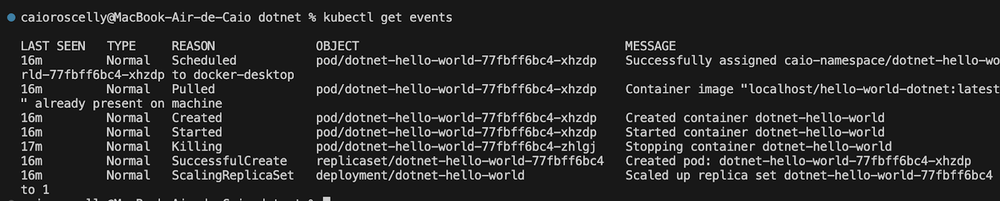

6. [Opcional] Se você tiver o [Kubernetes Lens](https://k8slens.dev/) ou [Docker Desktop](https://www.docker.com/products/docker-desktop/) instalados localmente, explore também os recursos utilizando a UI que essas ferramentas fornecem, como mostramos a seguir:

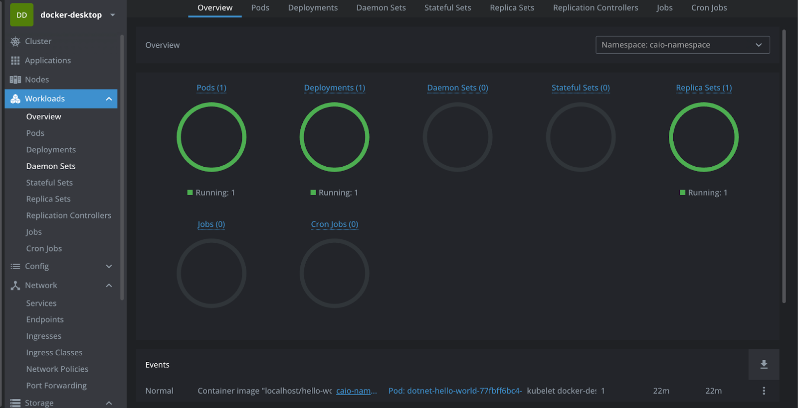

## Erros comuns
 
### ErrImagePull ou ImagePullBackOff

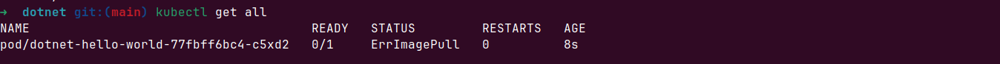

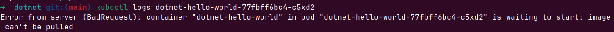

Esse erro significa que a imagem docker solicitada no [manifest.yaml](manifest.yaml) não foi encontrada no cluster Kind.
Para resolver, carregue a imagem docker no cluster:
```bash
kind load docker-image localhost/hello-world-dotnet --name <nome-do-cluster>
```

### Não consegue acessar pelo http://localhost:30000

O docker trabalha com tipos diferentes de rede em cada OS. Para saber mais acesse este [link](https://docs.docker.com/engine/network/).

Para resolver, vou mostrar possíveis soluções:

1. Port-forward:
Faça um [port-forward](https://kubernetes.io/docs/reference/kubectl/generated/kubectl_port-forward/) executando o comando abaixo e depois acesse http://localhost:30000:
```bash
kubectl port-forward svc/dotnet-hello-world-service 30000:8080
```

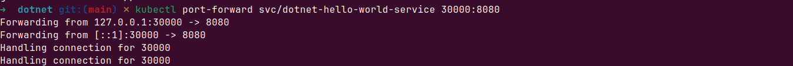

2. Node IP:
Acesse por meio do Node IP executando o comando abaixo:
```bash
kubectl get nodes -o wide
```
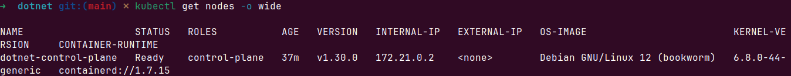

Após executar o comando copie o INTERNAL-IP e cole no navegador adicionando :30000, exemplo 172.21.0.2:30000

3. Caso deseje mapear a porta 30000 na criação do cluster, em [Deploy com Kubernetes](#deploy-com-kubernetes) substitua o comando `kind create cluster --name <nome-do--novo-cluster>` por `kind create cluster --config kind-config.yaml --name <nome-do--novo-cluster>`

O arquivo [kind-config.yaml](kind-config.yaml) é um arquivo de configuração para o Kind (Kubernetes in Docker). Ele define como o cluster Kubernetes será configurado e quais são as características dos nós (nodes) que compõem o cluster. Nesse arquivo está sendo mapeada a porta 30000. Após terminar os passos [Deploy com Kubernetes](#deploy-com-kubernetes) é só acessar http://localhost:30000